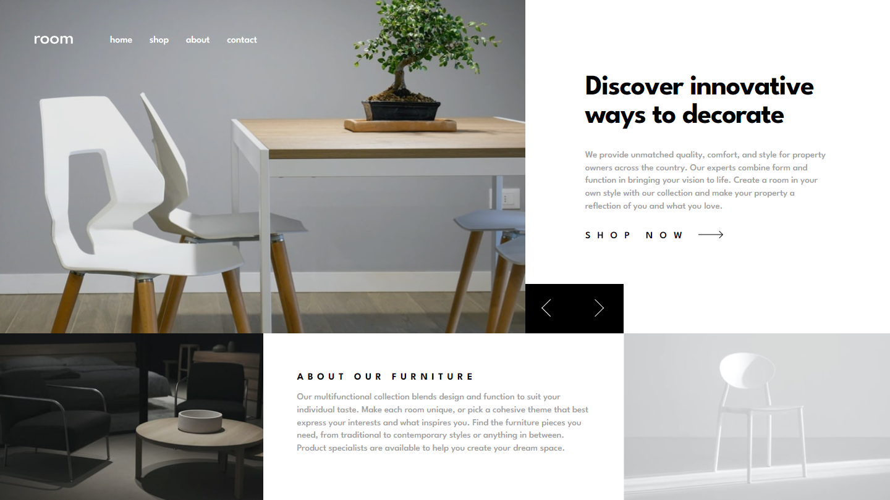

# Frontend Mentor - Room homepage solution

This is a solution to the [Room homepage challenge on Frontend Mentor](https://www.frontendmentor.io/challenges/room-homepage-BtdBY_ENq). Frontend Mentor challenges help you improve your coding skills by building realistic projects. 

## Table of contents

- [Overview](#overview)
  - [The challenge](#the-challenge)
  - [Screenshot](#screenshot)
  - [Links](#links)
- [My process](#my-process)
  - [Built with](#built-with)
  - [What I learned](#what-i-learned)
  - [Continued development](#continued-development)
  - [Useful resources](#useful-resources)
- [Author](#author)

## Overview

### The challenge

Users should be able to:

- View the optimal layout for the site depending on their device's screen size
- See hover states for all interactive elements on the page
- Navigate the slider using either their mouse/trackpad or keyboard

### Screenshot

### Links

- Solution URL: [Solution](https://www.frontendmentor.io/solutions/responsive-room-homepage-using-desktopfirst-approach-and-css-grid-CdEVJjAN5J)
- Live Site URL: [Live Site](https://imd94.github.io/room-homepage)

## My process

### Built with

- Semantic HTML5 markup
- CSS Flexbox
- CSS Grid
- BEM
- Desktop-first workflow
- Plain javascript for slider and mobile navigation toggle

### What I learned

At first glance, this layout looks like something easy to create, but when you dive into it, the tricky parts emerge. And that's exactly why it was perfect for improving CSS grid skills. As for JavaScript, there was a lot to learn as well, such as selecting DOM elements, writing basic functions, responding to click and keydown events, adding and removing classes from elements on click events, and so on.

### Continued development

- CSS grid
- Javascript functions

### Useful resources

- [Resource 1](https://www.udemy.com/course/50-projects-50-days) - From this course (Day 35 - Image Carousel), I learned to create a simple image carousel. It contains a lot of other small JavaScript projects as well that are a great source of learning.
- [Resource 2](https://developer.mozilla.org/en-US/docs/Web/API/Element/keydown_event) - This helped me to understand, how keydown event works in javascript.
- [Resource 3](https://css-tricks.com/snippets/css/css-triangle) - This helped me to learn, how to create arrows using css border.
- [Resource 4](https://codepen.io/Kezz/pen/mJOJQY) - This code pen from Kezz Bracey, helped me a lot to learn some css button animations.

## Author

- Website - [imdesign94](https://imdesign94.com)
- Frontend Mentor - [@imd94](https://www.frontendmentor.io/profile/imd94)
- Twitter - [I do not have a twitter account yet](https://www.twitter.com)
